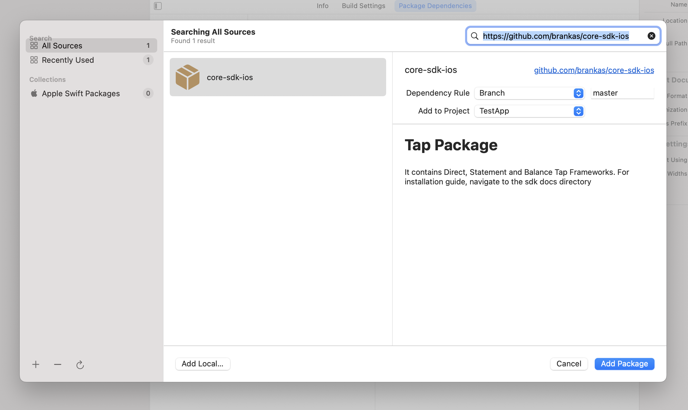
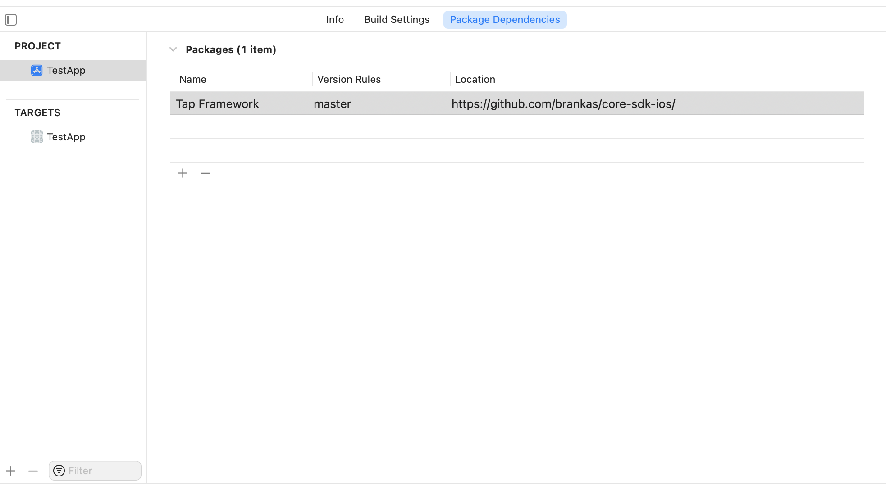

# Balance Tap Framework for iOS
***
*Version:* 1.1.0
***


## Table of Contents

  1. [About Framework](#about-framework)
  2. [Minimum Requirements](#requirements)
  3. [Installation](#installation)
  4. [Update](#update)
  5. [Initialization](#initialization)
  6. [Usage](#usage)

***

<a name="about-framework">
## About Framework
</a>

### What is Balance Tap Framework?
- **Balance Tap Framework** is a framework used to launch Tap Web Application inside an embedded WKWebView via **Balance API** (Application Programming Interface). 
- This framework helps mobile developers to integrate with Brankas Balance API Services with less setup needed and code implementation. 
- The framework provides the list of banks available for Balance Retrieval
- The framework also provides the **BalanceAccount** list object after balance retrieval has been successful or not

### Benefits of Using Balance Tap Framework
- **The framework provides everything that is needed**<br/> No need to setup NSURLConnection or any similar third-party library. Everything is already built within the framework. Just call the appropriate functions and the needed data will be returned.
- **The framework provides User Interface**<br/>No need to create a WKWebView or launch Safari Web Browser. The framework already provides an embedded WKWebView wherein built-in functions are done to detect successful or failed transactions
- **The Framework provides freedom and flexibility.**<br/>The developer has the option not to use the embedded WKWebView and create his own: the checkout URL can be used.<br/>The embedded WKWebView can be launched via another **ViewController** or be added as a **subview** of the current view passed by the developer
- **The Framework provides convenience.**<br/>The needed API Services are called sequentially and polling of transactions is handled internally. The balance account list object will be returned automatically after Tap Web Application Session<br/>The framework can be updated via **SwiftPackageManager** and no longer needs any installation from third-party libraries - everything that is needed will be downloaded automatically.
- **The Framework provides greater speed.**<br/>The Framework uses gRPC (Remote Procedure Call) mechanism to communicate with the API Services faster. Using gRPC is roughly 7 times faster than REST (Representational State Transfer) when receiving data and roughly 10 times faster when sending data

### How to Use 'Tap'?
- Just follow these easy steps to perform **Balance Retrieval**
1. Click **Continue** to accept terms and conditions regarding Privacy Policy in the Consent Page<br/><br/><br/><br/>
2. Select the desired bank in the Bank Selector Page and click **Continue**<br/><br/><br/><br/>
3. Enter the login credentials and click **Submit** <br/><br/><br/><br/>
4. Enter the OTP (One-time Password) and click **Submit** <br/><br/><br/><br/>
5. Wait until the balance retrieval is finished. Success Page will be shown subsequently.<br/><br/><br/><br/>

## Minimum Requirements

1. **Xcode 12** but preferably the latest version
2. Minimum Target iOS Deployment: **iOS 12**
3. Minimum Swift Tools Version: **5.3** but preferably the latest version

## Installation

This set of instructions assumes that the IDE being used is Xcode

1. The framework can be integrated to the project through the use of **SPM (Swift Package Manager)**. To integrate, click your project > **Package Dependencies**, then the '+' button <br/><br/>

2. On the search bar, enter the URL: **https://github.com/brankas/core-sdk-ios**. Wait for the repository to be loaded then click **Add Package** <br/><br/>

3. Check **BalanceTap** then click on **Add Package** <br/><br/>

4. Check if package has already been added as a dependency <br/><br/>

4. Go to **Frameworks, Libraries and Embedded Content** and check if the selected framework has been added <br/><br/>

5. The application can now be run without any additional dependency.

## Update

To update the framework to the latest version, go to **File** > **Packages** > **Update to Latest Package Versions** <br/><br/>

## Initialization

1. Call the initialize function from the BalanceTapFramework and pass the **API Key** provided by Brankas.

	```swift

	import BalanceTapFramework

	BalanceTapSF.shared.initialize(apiKey: "apiKey")

	```

***NOTE:* Before calling any function, it is important to call the *initialize* function first in order to gain access to the *checkout* function. Also, to use the Sandbox environment, set the *isDebug* variable to true**

## Usage

The Framework has a **checkout** function wherein it responds with a redirect url used to launch the Tap web application within built-in WKWebView or Safari Web Browser

In order to use the checkout function, a **BalanceTapRequest** is needed to be created and be passed. It has the following details:

1. **country** - refers to the country of origin of the bank you wanted to do balance retrieval with. There are three countries currently supported: *Philippines (PH)*, *Indonesia (ID)* and *Thailand (TH)*

2. **bankCodes** - refers to the list of banks to be shown within the Tap Web Application. If *null* value is passed, the Framework automatically fills up all the available banks depending on the country passed

3. **externalId** - refers to the identifier passed to track the request

4. **successURL** - refers to the URL where the user will be redirected to after a successful balance retrieval

5. **failURL** - refers to the URL where the user will be redirected to after a failed balance retrieval

6. **organizationName** - refers to the name of the organization that will be displayed while doing balance retrieval

7. **redirectDuration** - refers to the time in seconds when the user should be redirected upon finishing balance retrieval. The default value is *60 seconds*.

8. **browserMode** - **Safari** (Tap Web Application is launched through Safari Web Browser) and **WebView** (Tap Web application is launched through the built-in WKWebView from the Framework)<br/><br/>
***NOTE:*** When using the **WebView** BrowserMode, ensure that the ViewController to be passed in the checkout function is attached to a **UINavigationController** so that the Framework can provide a back button.

9. **dismissAlert** - pertains to the showing of alert dialog when closing the WebView. It consists of **message**, **positiveButtonText** and **negativeButtonText**. Just set this value to null to remove the alert dialog when closing the application.

10. **isAutoConsent** - refers to the automatic allowing of consent in behalf of the user of the Tap Web Application. Its default value is false

11. **useRememberMe** - pertains to using the remember me feature of the Tap Web Application (default value is true and will not be showing up if set to false)

Here is a sample on how to use it and call:

```swift

import UIKit
import BalanceTapFramework

class ViewController: UIViewController {
    typealias T = String
    
    override func viewDidLoad() {
        super.viewDidLoad()
        // Do any additional setup after loading the view.
        
        BalanceTapSF.shared.initialize(apiKey: "API KEY")

        let request = BalanceTapRequest(country: Country.PH, bankCodes: nil, externalId: "External ID", successURL: "https://google.com", failURL: "https://hello.com", organizationName: "Organization Name", redirectDuration: 60, browserMode: BalanceTapRequest.BrowserMode.WebView, isAutoConsent: false, dismissAlert: nil, useRememberMe: true)

        do {
            let retrieveBalances = { (data: Any?, error: String?) in
                if let str = data as? String {
            		if let err = error {
                		print("Balance ID: \(str)\nError: \(err)")
            		}
            		else {
                		print("Balance ID: \(str)")
            		}
        	}
        
        	else if let accounts = data as? [BalanceAccount] {
            		var message = "Accounts"
            		let dateFormatter = DateFormatter()
           	 	dateFormatter.dateFormat = "MM-dd-yyyy"
            
            		if accounts.isEmpty {
                		message += "\n\n\nList is Empty"
            		}
            		accounts.forEach { account in
			        message += "\n Account: \(account.holderName) (\(account.number))"
                		message += "\n Balance: \(account.balance.currency)\(Double(account.balance.numInCents) ?? 0 / 100)"
            		}
            		print(message)
        	}
        
        	else {
            		if let err = error {
                		showAlert(message: "Error: \(err)")
            		}
        	}
            }
            try BalanceTapSF.shared.checkout(balanceTapRequest: request, vc: self, closure: retrieveBalances, showBackButton: true)
        } catch {
            showAlert(message: "Error: \(error)")
        }
    }
}
```


