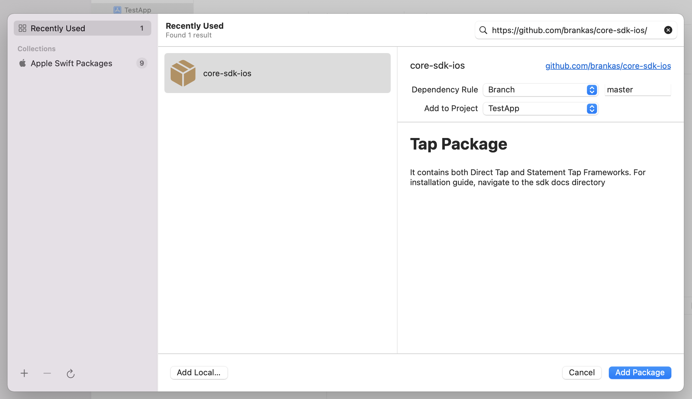

# Direct Tap Framework for iOS
***
*Version:* 3.2.0
***


## Table of Contents

  1. [About Framework](#about-framework)
  2. [Minimum Requirements](#requirements)
  3. [Installation](#installation)
  4. [Update](#update)
  5. [Initialization](#initialization)
  6. [Usage](#usage)

***

<a name="about-framework">
## About Framework
</a>

### What is Direct Tap Framework?
- **Direct Tap Framework** is a framework used to launch the interface for Tap Web Application via **Direct API** (Application Programming Interface). 
- This framework helps mobile developers to integrate with Brankas Direct API Services with less setup needed and code implementation. 
- With the embedded WKWebView that is provided within the framework, users can perform logging in and bank transfers. 
- The framework also provides the **Transaction** object after bank transfer has been successful or has failed

### Benefits of Using Direct Tap Framework
- **No need to setup NSURLConnection or any similar third-party library.**<br/> Everything is already built within the Framework. Just call the appropriate functions and the needed data will be returned
- **No need to create a WKWebView or launch Safari Web Browser.**<br/>The Framework already provides an embedded WKWebView wherein built-in functions are done to detect successful or failed transactions
- **The Framework provides freedom and flexibility.**<br/>The developer has the option not to use the embedded WebView and create his own: the checkout URL can be used.<br/>The embedded WKWebView can be launched via another **ViewController** or be added as a **subview** of the current view passed by the developer
- **The Framework provides convenience.**<br/>The needed API Services are called sequentially and polling of transactions is handled internally. The transaction object will be returned automatically after Tap Web Application Session<br/>The framework can be updated via **SwiftPackageManager** and no longer needs any installation from third-party libraries - everything that is needed will be downloaded automatically.
- **The Framework provides greater speed.**<br/>The Framework uses gRPC (Remote Procedure Call) mechanism to communicate with the API Services faster. Using gRPC is roughly 7 times faster than REST (Representational State Transfer) when receiving data and roughly 10 times faster when sending data
 

## Minimum Requirements

1. **Xcode 12** but preferably the latest version
2. Minimum Target iOS Deployment: **iOS 12**
3. Minimum Swift Tools Version: **5.3** but preferably the latest version

## Installation

This set of instructions assumes that the IDE being used is Xcode

1. The framework can be integrated to the project through the use of **SPM (Swift Package Manager)**. To integrate, click your project > **Package Dependencies**, then the '+' button <br/><br/>

2. On the search bar, enter the URL: **https://github.com/brankas/core-sdk-ios**. Wait for the repository to be loaded then click **Add Package** <br/><br/>

3. Check **DirectTap** then click on **Add Package** <br/><br/>

4. Check if package has already been added as a dependency <br/><br/>

4. Go to **Frameworks, Libraries and Embedded Content** and check if the selected framework has been added <br/><br/>

5. The application can now be run without any additional dependency.

## Update

To update the framework to the latest version, go to **File** > **Packages** > **Update to Latest Package Versions** <br/><br/>


## Initialization

1. Call the initialize function from the TapFramework and pass the **API Key** provided by Brankas.

	```swift

	import DirectTapFramework

	DirectTapSF.shared.initialize(apiKey: "apiKey", isDebug: false)

	```

***NOTE:* Before calling any function, it is important to call the *initialize* function first in order to gain access to the *checkout* function. Also, by default, *isDebug*  is set to *false* which uses the *Production* environment. To use the Sandbox environment, set the *isDebug* variable to *true***

## Usage

The Framework has a **checkout** function wherein it responds with a redirect url used to launch the Tap web application within built-in WKWebView or Safari Web Browser

In order to use the checkout function, a **DirectTapRequest** is needed to be created and be passed. It has the following details:

1. **sourceAccount** - the account to be used as a sender of money for bank transfer. It consists of **DirectBankCode** (code for a specific bank) and **Country** (country of origin)

***NOTE:*** If **bankCode** is set to **nil**, an internal bank selection screen will be shown inside Tap web application. If it has been filled up, that bank would automatically be selected instead.

2. **destinationAccountId** - the ID of the registered account of the receiver of money for bank transfer. This is provided by Brankas. Each registered account has a corresponding ID.

3. **amount** - the amount of money to be transferred. It consists of **Currency** (the currency of the money to be transferred) and **numInCents** - amount in centavos (e.g. If value to be transferred is PHP 1, the value to be passed in amount should be "100" - value is multiplied by 100).

4. **memo** - the note or description attached to the bank transfer

5. **customer** - pertains to the details of the sender of money. It consists of **firstName**, **lastName**, **email** and **mobileNumber**

6. **referenceId**

7. **client** - pertains to the customizations in the Tap Web Application and callback url once bank transfer is finished. It consists of **displayName** (name in the header to be shown in the Tap Web Application), **logoUrl** (URL of the logo to be shown), **returnUrl** (URL where Tap would be redirecting after bank transfer is finished), **failUrl** (optional URL where Tap would be redirecting if bank transfer has failed), **statementRetrieval** (Bool that shows the list of statements after bank transfer is finished; its default value is false)

8. **browserMode** -  **Safari** (Tap Web Application is launched through Safari Web Browser) and **WebView** (Tap Web application is launched through the built-in WKWebView from the Framework, this is the default value)<br/><br/>
***NOTE:*** When using the **WebView** BrowserMode, ensure that the ViewController to be passed in the checkout function is attached to a **UINavigationController** so that the Framework can provide a back button.

9. **dismissAlert** - pertains to the showing of alert dialog when closing the WebView. It consists of **message**, **positiveButtonText** and **negativeButtonText**. Just set this value to null to remove the alert dialog when closing the application.

10. **useRememberMe** - pertains to using the remember me feature of the Tap Web Application (default value is true and will not be showing up if set to false)

11. **expiryDate** -  refers to the expiry time of the created invoice

12. **uniqueAmount** -  refers to the enabling of centavo reconciliation workaround logic

Here is a sample on how to use it and call:

```swift

import UIKit
import DirectTapFramework

class ViewController: UIViewController {
    
    override func viewDidLoad() {
        super.viewDidLoad()
        // Do any additional setup after loading the view.
        
        DirectTapSF.shared.initialize(apiKey: "hjkozDM1YcaE00q60T2qCj3s4Pb1ui0p3K2V6hjyu5AxR7A8E0IAK5G1u4sRrbcH5", certPath: nil, isDebug: true)
        
        let account = DirectAccount(country: Country.PH)
        let amount = Amount(currency: Currency.php, numInCents: "10000")
        let customer = Customer(firstName: "First", lastName: "Last", email: "hello@gmail.com", mobileNumber: "63")
        var client = Client()
        client.displayName = "Display Name"
        client.returnUrl = "www.google.com"
    	
	var request = DirectTapRequest(sourceAccount: account, destinationAccountId: "5887e376-383c-11eb-b400-4hsddb0c633ac", amount: amount, memo: "Bank Transfer", customer: customer, referenceId: "sample-reference", client: client, dismissAlert: DismissAlert(message: "Do you want to close the application?", confirmButtonText: "Yes", cancelButtonText: "Cancel"))
        
        request.browserMode = TapRequest.BrowserMode.WebView
        do {
            let result = { (data: DirectTapFramework.Transaction?, error: String?) in
        	if let transaction = data {
            		print("TRANSACTION ID: \(transaction.id)")
        	}
        
        	if let err = error {
            		print("Error Logs: \(err)")
        	}
		}
            try DirectTapSF.shared.checkout(tapRequest: request, vc: self, closure: result)
        } catch {
            print("Error: \(error)")
        }
    }
}
```

**NOTE: To check if the transaction is successful or not, check the *status* from the Transaction object**
