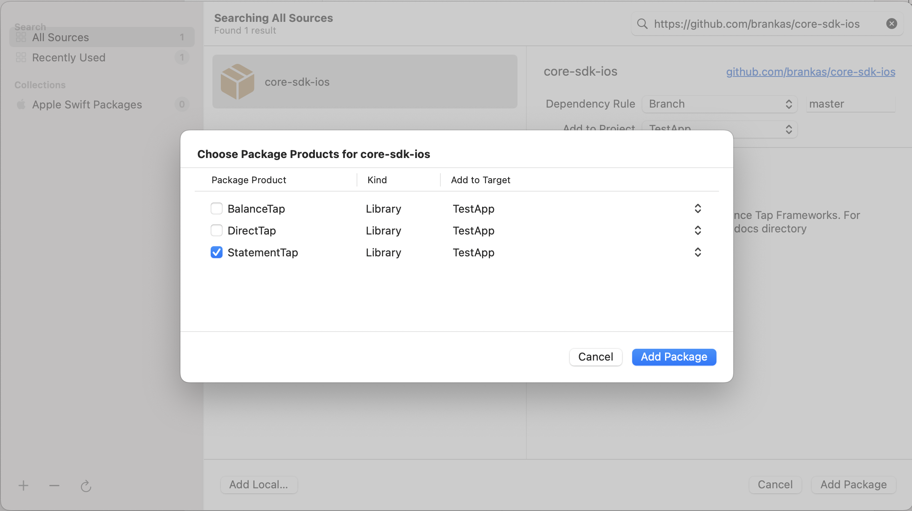
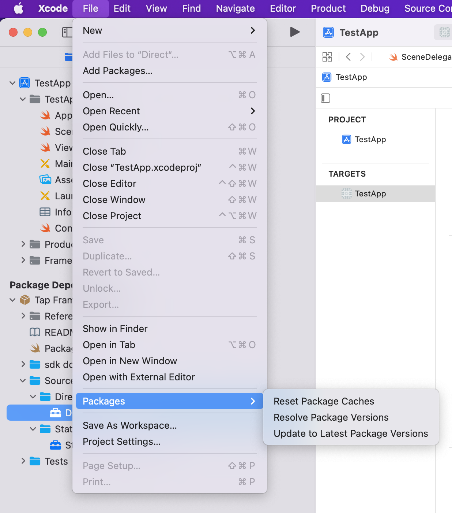

# Statement Tap Framework for iOS
***
*Version:* 2.1.0
***


## Table of Contents

  1. [Minimum Requirements](#requirements)
  2. [Installation](#installation)
  3. [Update](#update)
  4. [Initialization](#initialization)
  5. [Usage](#usage)

***

## Minimum Requirements

1. **Xcode 12** but preferably the latest version
2. Minimum Target iOS Deployment: **iOS 12**
3. Minimum Swift Tools Version: **5.3** but preferably the latest version

## Installation

This set of instructions assumes that the IDE being used is Xcode

1. The framework can be integrated to the project through the use of **SPM (Swift Package Manager)**. To integrate, click your project > **Package Dependencies**, then the '+' button <br/><br/>

2. On the search bar, enter the URL: **https://github.com/brankas/core-sdk-ios**. Wait for the repository to be loaded then click **Add Package** <br/><br/>

3. Check **StatementTap** then click on **Add Package** <br/><br/>

4. Check if package has already been added as a dependency <br/><br/>

4. Go to **Frameworks, Libraries and Embedded Content** and check if the selected framework has been added <br/><br/>

5. The application can now be run without any additional dependency.

## Update

To update the framework to the latest version, go to **File** > **Packages** > **Update to Latest Package Versions** <br/><br/>

## Initialization

1. Call the initialize function from the TapFramework and pass the **API Key** provided by Brankas.

	```swift

	import StatementTapFramework

	StatementTapSF.shared.initialize(apiKey: "apiKey")

	```

***NOTE:* Before calling any function, it is important to call the *initialize* function first in order to gain access to the *checkout* function. Also, to use the Sandbox environment, set the *isDebug* variable to true**

## Usage

The Framework has a **checkout** function wherein it responds with a redirect url used to launch the Tap web application. An option is given either to use the url manually or let the Framework launch it via Safari Web Browser

In order to use the checkout function, a **StatementTapRequest** is needed to be created and be passed. It has the following details:

1. **country** - refers to the country of origin of the bank you wanted to do statement retrieval with. There are three countries currently supported: *Philippines (PH)*, *Indonesia (ID)* and *Thailand (TH)*

2. **bankCodes** - refers to the list of banks to be shown within the Tap Web Application. If *null* value is passed, the SDK automatically fills up all the available banks depending on the country passed

3. **externalId** - refers to the identifier passed to track the request

4. **successURL** - refers to the URL where the user will be redirected to after a successful statement retrieval

5. **failURL** - refers to the URL where the user will be redirected to after a failed statement retrieval

6. **organizationName** - refers to the name of the organization that will be displayed while doing statement retrieval

7. **redirectDuration** - refers to the time in seconds when the user should be redirected upon finishing statement retrieval. The default value is *60 seconds*.

8. **browserMode** - **Safari** (Tap Web Application is launched through Safari Web Browser) and **WebView** (Tap Web application is launched through the built-in WKWebView from the Framework)<br/><br/>
***NOTE:*** When using the **WebView** BrowserMode, ensure that the ViewController to be passed in the checkout function is attached to a **UINavigationController** so that the Framework can provide a back button.

9. **dismissAlert** - pertains to the showing of alert dialog when closing the WebView. It consists of **message**, **positiveButtonText** and **negativeButtonText**. Just set this value to null to remove the alert dialog when closing the application.

10. **isAutoConsent** - refers to the automatic allowing of consent in behalf of the user of the Tap Web Application. Its default value is false

11. **useRememberMe** - pertains to using the remember me feature of the Tap Web Application (default value is true and will not be showing up if set to false)

12. **statementRetrievalRequest** - pertains to the statement retrieval after Tap Web Session. **startDate** and **endDate** can be configured to retrieve transactions within date range

Here is a sample on how to use it and call:

```swift

import UIKit
import StatementTapFramework

class ViewController: UIViewController {
    typealias T = String
    
    override func viewDidLoad() {
        super.viewDidLoad()
        // Do any additional setup after loading the view.
        
        StatementTapSF.shared.initialize(apiKey: "API KEY")

        let request = StatementTapRequest(country: Country.PH, bankCodes: nil, externalId: "External ID", successURL: "https://google.com", failURL: "https://hello.com", organizationName: "Organization Name", redirectDuration: 60, browserMode: StatementTapRequest.BrowserMode.WebView, isAutoConsent: false, dismissAlert: nil, useRememberMe: true, statementRetrievalRequest: StatementRetrievalRequest())

        do {
            let retrieveStatements = { (data: Any?, error: String?) in
                if let str = data as? String {
            		if let err = error {
                		print("Statement ID: \(str)\nError: \(err)")
            		}
            		else {
                		print("Statement ID: \(str)")
            		}
        	}
        
        	else if let statements = data as? [Statement] {
            		var message = "Statements"
            		let dateFormatter = DateFormatter()
           	 	dateFormatter.dateFormat = "MM-dd-yyyy"
            
            		if statements.isEmpty {
                		message += "\n\n\nList is Empty"
            		}
            		statements.forEach { statement in
                		statement.transactions.forEach { transaction in
                    			let amount = transaction.amount
                    			message += "\n Account: \(statement.account.holderName)"
                    			message += "\n Transaction: (\(dateFormatter.string(from: transaction.date))) "
                    			message += String(describing: amount.currency)
                    			message += " \(Double(amount.numInCents) ?? 0 / 100)"
                    			message += " \(String(describing: transaction.type))"
                		}
            		}
            		print(message)
        	}
        
        	else {
            		if let err = error {
                		showAlert(message: "Error: \(err)")
            		}
        	}
            }
            try StatementTapSF.shared.checkout(statementTapRequest: request, vc: self, closure: retrieveStatements, showBackButton: true)
        } catch {
            showAlert(message: "Error: \(error)")
        }
    }
}
```


